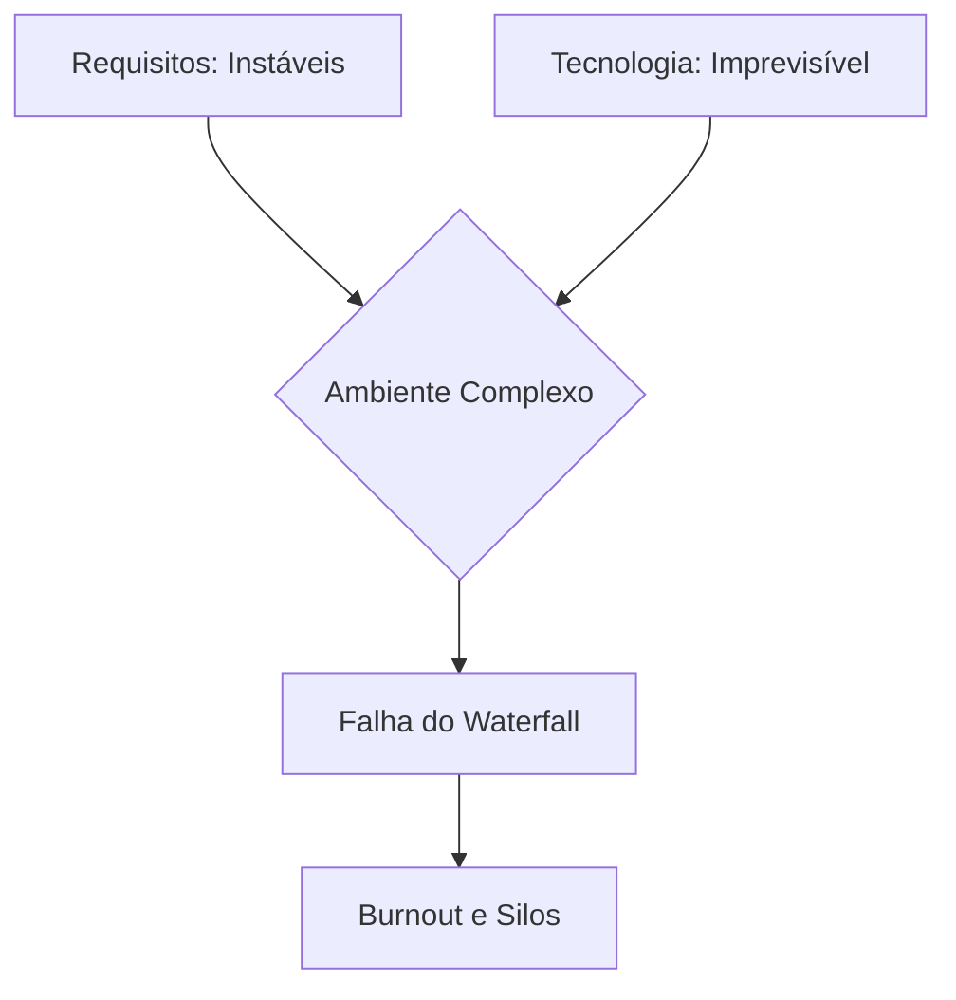
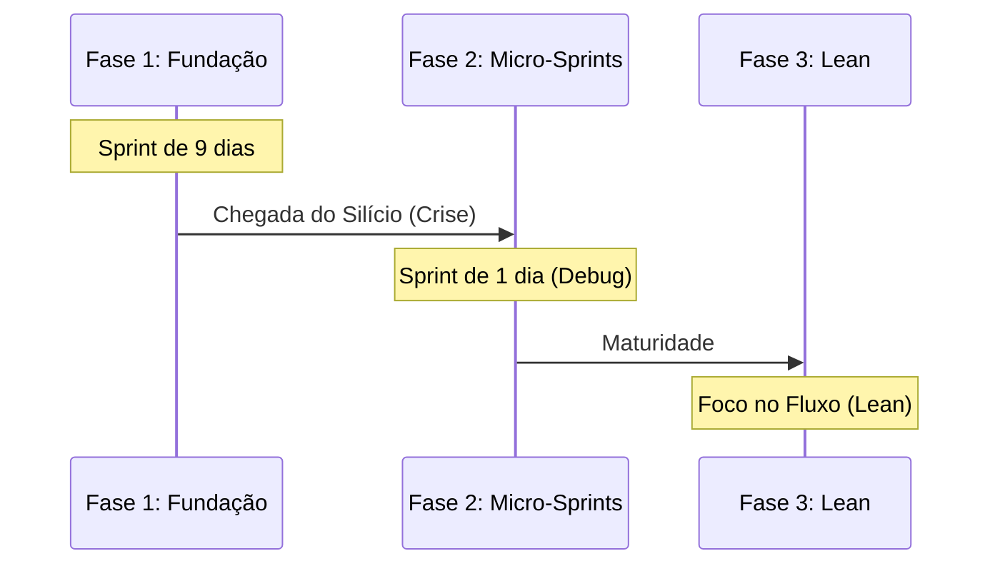

# Resenha Crítica: A Odisseia do Scrum na Intel

## 📌 Sobre o Projeto
Este repositório contém uma análise técnica profunda do estudo de caso **"Agile Project Development at Intel: A Scrum Odyssey"**. O documento explora a transição do modelo Waterfall para o Scrum no grupo de *Product Development Engineering* (PDE) da Intel, em Oregon.

O objetivo desta resenha é demonstrar como a agilidade pode ser adaptada para ambientes de alta complexidade técnica e incerteza tecnológica (manufatura de semicondutores).

---

## 🛠️ O Diagnóstico do Setor
Antes da agilidade, o PDE operava em um estado de "caos" devido a requisitos instáveis e tecnologia imprevisível. 

### Matriz de Stacey (Contexto do Projeto)

* **Handoffs Fragmentados:** Silos que impediam o fluxo de valor.

* **Burnout Técnico:** Jornadas de 80h+ e moral em colapso.

---

## 🚀 A Evolução em Três Fases

A Intel não seguiu uma receita estática, mas adaptou o framework conforme a necessidade do projeto.

### Diagrama de Adaptação de Sprints

1. **Fase 1:** Foco na legitimidade do ScrumMaster como papel técnico e estabelecimento da cadência de 9 dias.

2. **Fase 2:** Adaptação extrema com Sprints de 1 dia para gestão de crise durante os testes de hardware ("silício").

3. **Fase 3:** Evolução para *Feature Scrums* e eliminação de silos funcionais baseada na filosofia Lean.

---

## 📊 Governação e Métricas

A Intel implementou papéis customizados para escalar de 7 para 18 equipes.

### Papéis Customizados

* **Story Owners:** Responsáveis técnicos pelo sucesso da funcionalidade.

* **Transients:** Especialistas nômades para Sprints de alta complexidade.

* **Conduits:** Facilitadores entre equipes locais e remotas.

### Tabela de Indicadores de Qualidade

| Métrica | Definição | Insight de Gestão |
| --- | --- | --- |
| **Adds** | Critérios novos na Review | Requisitos mal refinados.

 |
| **Saves** | Bugs detectados na Sprint | Eficácia da revisão por pares.

 |
| **Escapes** | Bugs de Sprints passadas | Falhas na validação técnica profunda.

 |

---

## 📈 Resultados e Conclusão

A maior inovação observada foi a **redução de 66% no Cycle Time**. O uso do Scrum permitiu que a Intel recuperasse a credibilidade de um projeto atrasado através do empirismo e da redução de desperdícios.

> 
> **Lição Principal:** O Scrum não é uma receita rígida, mas uma estrutura viva que deve navegar conforme a incerteza do projeto.
> 
> 

---

## 👤 Autor

**Luiz Henrique Gonçalves** 

* Estudante de Análise e Desenvolvimento de Sistemas (IFSP)
* Documento desenvolvido para o Desafio de Projeto - **DIO**.

